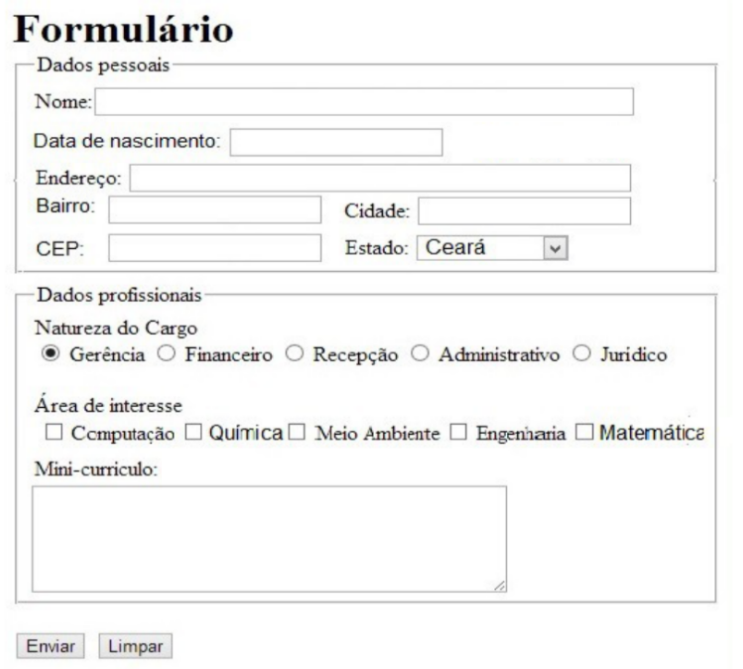

## Lista 1 - Programação para Web 1

### Exercıcio 1:
Escreva os codigos HTML necessarios para a construcao da tela a seguir.

### Exercıcio 2:
Imagine que você foi contratado para construir uma p ́agina web que sintetize as principais informações de usuário, conforme o formulário anterior. E um requisito do sistema que essas informacoes sejam apresentadas em forma de tabela. Escreva os códigos HTML necessários.

